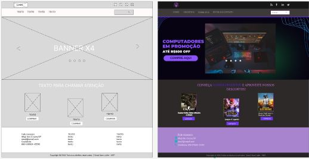

# Loja Gamer
> Proposta do trabalho:
> ETAPA 1: Preencha a documentação de Briefing 

>ETAPA 2: Faça uma pesquisa de modelos de sites do segmento para ter como referencia e documente isto.
• Pense e descreva sua ideia, justifique suas escolhas de cores, layout com base na teoria do design. 

> ETAPA 3: Crie os Wireframes do projeto (Figma ou outro): 
• 3 páginas: “Home”, “Produtos”, “Quem Somos” 
• Montar a versão desktop e Mobile para as 3 telas. 
• Na página “Quem Somos”, crie um formulário 

> ETAPA 4: Crie o protótipo de alta fidelidade das páginas criadas na etapa anterior (Figma ou outro):
 • 3 páginas: Home, Produtos, Quem somos 
• Montar a versão desktop e Mobile para as 3 telas. 

> ETAPA 5: Construa as 3 telas usando HTML e CSS 
• 3 páginas: Home, Produtos, Quem somos

> Exemplos de alguns protótipos criados:
  
 
 
  
